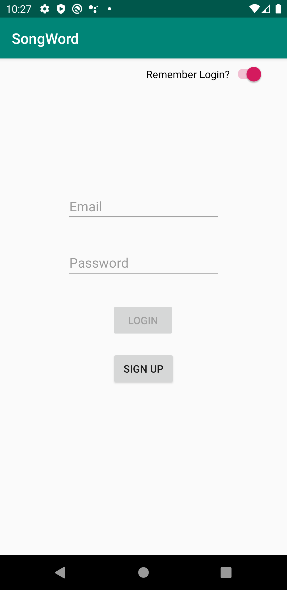

# CSCI 4237 - Project 2 - BYOI
SongWord - It's an app that finds songs for the words you search

## App Details
1. Users sign into their account, or....  

  

2. Create a new account  

  

3. Users will eneter in a word that they want to search for  

  

4. The definition of the word is returned as well as the song results  
 

## API/SDK Usage
 This Project uses the following APIs : [Spotify Search API](https://developer.spotify.com/documentation/web-api/reference/search/search/), [Google Firebase Authorization SDK](https://firebase.google.com/docs/auth), and [Webster Dictionary API](https://dictionaryapi.com)
 
 ##### This project was done for class Software Design for Handheld Devices in Spring 2020
